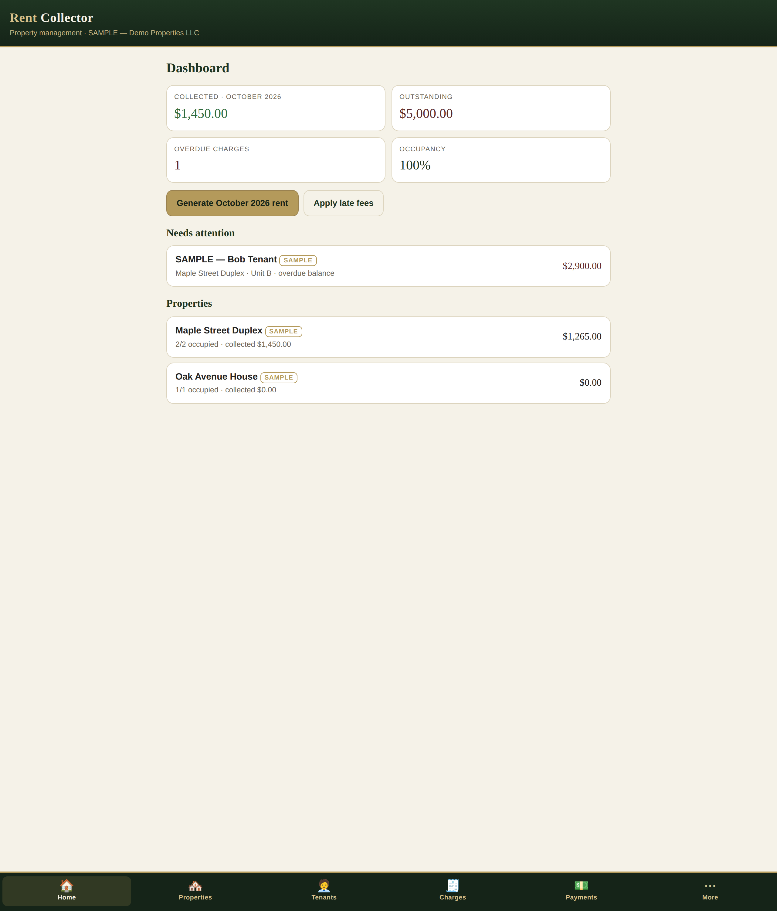

# Rent Collector

Property management and rent collection for landlords — as a progressive web app
(PWA) wrapped with Capacitor for the iOS App Store.

**Project:** `~/workspace/rent-collector/` · Web app: `docs/` · iOS project: `ios/`
App name: **Rent Collector** · Bundle ID: `com.thebullbrew.rentcollector`

No backend, no build step, no network calls. All data lives in the browser's
localStorage under the key `rentcollector.v1` (Export / Import / Reset in
Settings). Money is stored as integer cents and formatted with
`Intl.NumberFormat`.

## Features

- **Dashboard** — collected this month, outstanding balance, overdue count,
  occupancy %; overdue tenants list; per-property snapshot; one-tap
  **"Generate this month's rent charges"** (idempotent — never duplicates a
  tenant+month) and **"Apply late fees"**.
- **Properties** — CRUD; units CRUD per property; expenses CRUD per property.
- **Tenants** — CRUD; unit assignment (one active tenant per unit); auto
  4-digit portal PIN; per-tenant **Stripe payment link** field;
  "Copy portal login" (link + phone + PIN).
- **Charges** — filterable list (open / overdue / paid / all); manual charges
  (rent, late fee, utility, other); waive; per-charge detail with payments.
- **Payments** — record against a charge (partial allowed; status flips
  unpaid → partial → paid automatically) or unallocated; method badges
  (Stripe, Apple Pay, Zelle, Venmo, Cash App, cash, check, bank transfer…);
  delete with balance recalc.
- **Tenant portal** (`#/portal`) — tenant logs in with phone + PIN; sees
  balance due, charges, payment history; big gold **Pay rent** button opens
  their Stripe payment link (Apple Pay works on Stripe links for iPhone);
  graceful "contact your landlord" fallback when no link is set.
- **Reminders** — "Copy reminder text" on any overdue charge: polite-but-firm
  SMS with name, amount, due date, and pay link when present.
- **Reports** — monthly collections (expected vs collected vs outstanding +
  collection rate), per-property P&L (rent collected − expenses), CSV export.
- **Settings** — business name, currency, late-fee policy (grace days, flat or
  %), Stripe how-to explainer, JSON export/import, sample-data removal, reset.
- **First run** — clearly-labeled SAMPLE data (2 properties, 3 tenants,
  charges, payments) so every screen has something to show; one-tap removal.

## Collecting money

Rent Collector doesn't move money itself — it records what you collect.
For online payments: create **Payment Links** at stripe.com (one link per rent
amount, reusable across tenants), paste each tenant's link into their tenant
record, and the portal's Pay button opens your Stripe checkout. Record the
payment here with method "Stripe" when it lands. The Settings screen walks
through this step by step.

## Run it now (PWA)

```bash
cd ~/workspace/rent-collector/docs
python3 -m http.server 8000
# open http://localhost:8000 — or serve over LAN and "Add to Home Screen" on iPhone
```

## Tests

```bash
node /tmp/rctest.js   # 58 assertions: store math, idempotency, views, routes, portal
```

## Ship it to the App Store (needs a Mac)

Everything is built; only the signed build + upload needs macOS:

1. **Apple Developer account** — enroll at developer.apple.com ($99/yr).
2. Copy this project to the Mac. Open `ios/App/App.xcworkspace` in Xcode.
3. In Xcode: select the App target → Signing & Capabilities → set your Team.
   (Bundle ID `com.thebullbrew.rentcollector` is already set.)
4. `npx cap sync ios` was already run from the project root after the last web
   change; re-run it after any future web change before archiving.
5. Bump version in Xcode (Marketing Version / Build).
6. **Product → Archive**, then **Distribute App → App Store Connect** → upload.
7. In App Store Connect: create the app record, add screenshots (6.7" and 6.5"
   required), description, keywords, support URL, and a **privacy policy URL**
   (required — disclose that all data stays on-device; no account, no tracking).

## Files

```
docs/                PWA (the whole app — this is what ships)
  index.html         app shell + tab bar
  css/app.css        old-money theme (hunter green / ivory / antique gold)
  js/util.js         formatting, dates, modal, toast, form helpers
  js/store.js        localStorage data layer, charge engine, dashboard math
  js/views.js        dashboard, properties, tenants
  js/ledger.js       charges, payments, reports, settings
  js/portal.js       tenant self-service portal (#/portal)
  js/app.js          hash router + boot
  icons/             PWA icons (gold "R" monogram on hunter green)
  manifest.webmanifest
  sw.js              offline app-shell cache
ios/                 Capacitor iOS project (App.xcworkspace — open in Xcode)
capacitor.config.json  (webDir: docs)
package.json
```

## Notes & limits (v1)

- Single-device: data lives in one browser's localStorage. Use Export JSON
  regularly as backup; multi-device sync would need a backend (future).
- Tenant portal login is phone + PIN — convenience-grade, not bank-grade.
  Fine for "see my balance and tap Pay"; don't put sensitive documents here.
- Late fees apply per overdue charge per month (no compounding within a month).
- Overdue = dueDate + graceDays < today and balance > 0.
